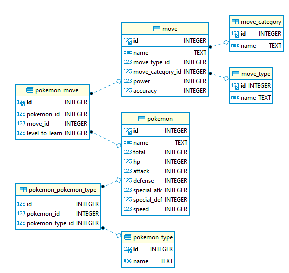

# pokedex-db-sample

[![MIT License][license-shield]][license-url]
[![LinkedIn][linkedin-shield]][linkedin-url]

<!-- PROJECT LOGO -->
 

  

  <h3 align="center">pokedex-db-sample</h3>

  

    This project is a sample of a database for Pokedex with SQL Create scripts and his respectives data. 
     
     
    The Pokedex site used (only Kanto Region) : 
    <a href="https://pokemondb.net/pokedex/stats/gen1"><strong>PokemonDb</strong></a>
     
  

<!-- TABLE OF CONTENTS -->
## Table of Contents

* [About the Project](#about-the-project)
  * [Databases Support](#current-databases-support)
* [Getting Started](#getting-started)
  * [Prerequisites](#prerequisites)
  * [Project Folder Structure](#project-folder-structure)
  * [Entity–relationship model of database](#entity–relationship-model-of-database)
* [To-do](#to-do)
* [Contributing](#contributing)
* [License](#license)
* [Contact](#contact)
* [Acknowledgements](#acknowledgements)

<!-- ABOUT THE PROJECT -->
## About The Project

When we want to learn a language or start a project, we always find ourselves standing without a data source to help us.
This project provides a simple and well-known database for easy access and use by anyone who needs data for their activities

Here's why:
* As a developer we have to be constantly learning and optimizing our knowledge
* When you are learning things , see examples is one of the best ways to start
* Let's all agree here we know all the first generation of pokemon. Who doesn't like pokemon?

You may also suggest changes by forking this repo and creating a pull request or opening an issue.

A list of commonly used resources that I find helpful are listed in the acknowledgements.

### Current Databases Support

* [SQLite](https://www.sqlite.org/index.html)

<!-- GETTING STARTED -->
## Getting Started

### Prerequisites

* None :).
* Well, a database administration tool, suggestions:
    * [DB Browser for SQLite](https://sqlitebrowser.org/) if you use SQLite (you can use another browser)
    * [DBeaver](https://dbeaver.io/) it's free and database agnostic.

### Project Folder Structure

1. :file_folder: **raw**
    `Folder for raw scripts, non normalized data.`
2. :file_folder: **normalized**
    `Folder for normalized scripts, with all entities.`
3. :file_folder: **resource**
    `Folder for all project resources, like images and other utils.`

### Entity–relationship model of database

## To-do

- [x] Add support for relational databases:  
  - [x] SQLite
  - [ ] Mysql
  - [ ] PostgreSQL
- [ ] Add suport for NoSql databases:
  - [ ] MongoDB
  - [ ] Neo4J

<!-- CONTRIBUTING -->
## Contributing

Contributions are what make the open source community such an amazing place to be learn, inspire, and create. Any contributions you make are **greatly appreciated**.

1. Fork the Project
2. Create your Feature Branch (`git checkout -b feature/AmazingFeature`)
3. Commit your Changes (`git commit -m 'Add some AmazingFeature'`)
4. Push to the Branch (`git push origin feature/AmazingFeature`)
5. Open a Pull Request

<!-- LICENSE -->
## License

Distributed under the MIT License. See `LICENSE` for more information.

<!-- CONTACT -->
## Contact

João Vitor Esperandio Barbosa - jsperandiob@gmail.com

<!-- ACKNOWLEDGEMENTS -->
## Acknowledgements
* [Pokemon Database](https://pokemondb.net/)
* [Img Shields](https://shields.io)
* [Choose an Open Source License](https://choosealicense.com)
* [GitHub Pages](https://pages.github.com)

<!-- MARKDOWN LINKS & IMAGES -->
[license-shield]: https://img.shields.io/github/license/othneildrew/Best-README-Template.svg?style=flat-square
[license-url]: https://github.com/jsperandio/pokedex-selenium/blob/master/LICENSE
[linkedin-shield]: https://img.shields.io/badge/-LinkedIn-black.svg?style=flat-square&logo=linkedin&colorB=555
[linkedin-url]: https://www.linkedin.com/in/jsperandiob/